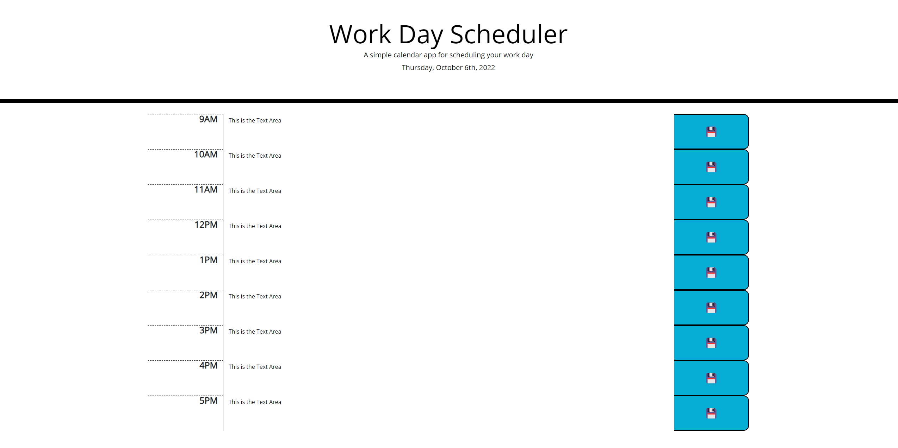

# Challenge 5
Work Scheduler/Daily Planner

## Description
For this challenge we were tasked to create a Daily Planner.
I was able to complete the styling with Bootstrap and was able to
put the time in the jumbotron with MomentJS. I went through after some
help from a class mate and was able to completed this challenge with
gaining more understanding of JS! 

## Tasks Assigned
```
GIVEN I am using a daily planner to create a schedule
WHEN I open the planner
THEN the current day is displayed at the top of the calendar
WHEN I scroll down
THEN I am presented with timeblocks for standard business hours
WHEN I view the timeblocks for that day
THEN each timeblock is color coded to indicate whether it is in the past, present, or future
WHEN I click into a timeblock
THEN I can enter an event
WHEN I click the save button for that timeblock
THEN the text for that event is saved in local storage
WHEN I refresh the page
THEN the saved events persist
```

## Technologies Used
Javascript, HTML, & CSS (*CSS & HTML were given as starter code*)

## Screenshots of Website


## Credits
Univeristy of Texas (Austin) & Bootcamp Spot (Trilogy)

## License
This follows the MIT License